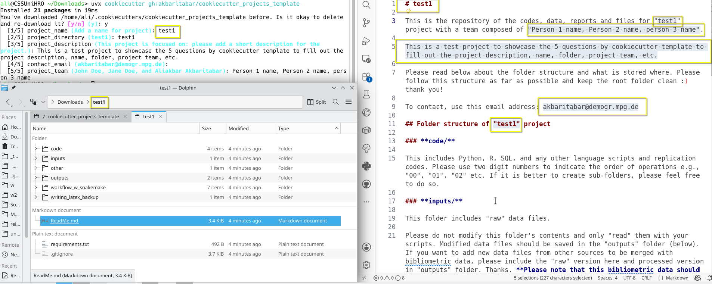

# How to use project templates?

My (former) usual practice was to create a Python virtual environment, then install cookiecutter and use it to create new project directories with this template. Those projects of course will have their own Python, R, etc. requirements that needs to be installed afterwards to use.

Below, I have added an updated approach that simplified by using [uv](https://github.com/astral-sh/uv).

## (simplified/updated approach) Steps with UV to use the cookiecutter template

0. Open a terminal
1. Install uv, see `https://docs.astral.sh/uv/getting-started/installation/`
2. To use this template with cookiecutter simply do `uvx cookiecutter gh:akbaritabar/cookiecutter_projects_template`
3. Answer the questions asked and it will create a project in your terminal's working directory using this template. It will include all the files and ReadMe items which now are populated using your answers to the questions about the project.

### Example of terminal showing template's starting questions

Here in the photo you can see a terminal window (top left) with the 5 starting questions that I have defined in the template, shown in highlighted yellow boxes, to fill out the project folder (bottom left) and ReadMe file with descriptions with team members, contact email, project description, etc (left).

### Steps to extend the project folder using UV and install requirements etc (if needed)

1. In the terminal, cd to the project folder created above, and to use a specific version of Python `uv init --python 3.13`
2. To add all packages listed in requirements `uv add -r requirements.txt`
4. Now, to run code using `snakemake` use `uvx` (or `uv tool run`) as in `uvx snakemake --version`
5. Or to use VS Code that already inherits the environment created by uv do `code .`
6. Or for Jupyter lab do `uv run --with jupyter jupyter lab`
7. To see requirements and project's dependencies `uv tree` and to record all those that are installed so far with `requirements.txt` or by `uv add packageName` (and removed by `uv remove packageName`) `uv sync`

## (older approach) Steps to use the template

1. Open a terminal
2. Install vanilla Python from: [https://www.python.org/](https://www.python.org/)
   1. See [my guidelines on using Pyenv](https://github.com/akbaritabar/course-session-on-Other-Computational-Social-Science-Skills/tree/main/Hands_on)
3. Create a folder e.g., `projectTemplates` and use `Virtualenv` to create `env` inside it with `python -m virtualenv env`, activate it with `.\Scripts\activate.bat` (on Windows), and install the requirements, i.e., `python -m pip install -r requirements.txt`
4. Then cd to 'C:\projectTemplates' which is now a vanilla Python environment created for cookiecutter templates using the 'requirements.txt' file in this directory (which simply includes cookiecutter. I also included the data science template, that could be useful but is more elaborated than what I needed).
5. To use the GitHub version of my own template, do `cookiecutter 'https://github.com/akbaritabar/cookiecutter_projects_template'`
6. Answer the questions asked and it will create a project in your terminal's working directory using this template. It will include all the files and ReadMe items which now are populated using your answers to the questions about the project.
7. Create a virtual environment for Python and install requirements as I wrote above (See [my guidelines on using Pyenv](https://github.com/akbaritabar/course-session-on-Other-Computational-Social-Science-Skills/tree/main/Hands_on)) and enjoy!
